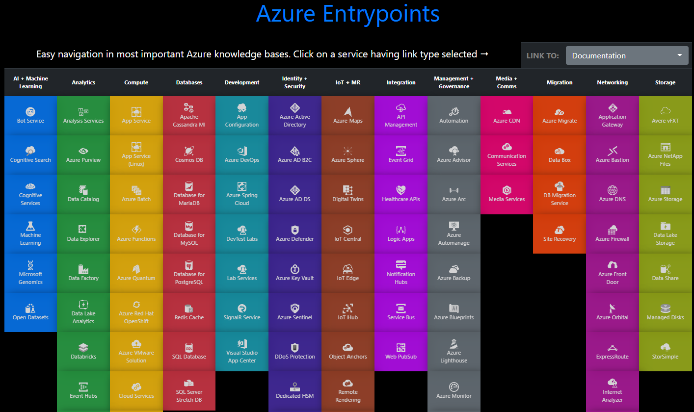

---
# Feel free to add content and custom Front Matter to this file.
# To modify the layout, see https://jekyllrb.com/docs/themes/#overriding-theme-defaults
layout: page
title: Azure Services
subtitle: How to get started with Microsoft Azure
hero_image: img/hero_image5.jpg
hero_darken: false

menubar: menu
---

**Azure Charts** is a great way to quickly find a lot of information on many Azure Services.

[https://azurecharts.com/links](https://azurecharts.com/links)

# Microsoft Docs and Learn

You'll find all kinds of docs, tutorials end learning paths there:

- [Microsft Azure Docs](https://docs.microsoft.com/en-us/azure/?product=featured)
- [Microsoft Learn](https://docs.microsoft.com/learn/)

## Azure Compute

Run apps in containers

- [Azure App Service](https://docs.microsoft.com/en-us/azure/app-service/)
- [Azure Functions (Serverless)](https://docs.microsoft.com/en-us/azure/azure-functions/)
- [Azure Static WebApps ("JAMStack")](https://docs.microsoft.com/en-us/azure/static-web-apps/)

## Storage & Databases

- [Azure CosmosDB](https://docs.microsoft.com/en-us/azure/cosmos-db/)
- [Azure PostGres](https://docs.microsoft.com/en-us/azure/postgresql/)
- [Azure MySQL](https://docs.microsoft.com/en-us/azure/mysql/)

## Machine Learning, A.I. and Cognitive

- [Azure Machine Learning](https://docs.microsoft.com/en-us/azure/machine-learning/)
- [Azure Cognitive Services (Vision/Language/Speech/Decision)](https://docs.microsoft.com/en-us/azure/cognitive-services/)
- [Bot Framework Composer](https://docs.microsoft.com/en-us/composer/)

## Maps and Mixed Reality

- [Azure Maps](https://docs.microsoft.com/en-us/azure/azure-maps/)
- [Azure Object Anchors](https://docs.microsoft.com/en-us/azure/object-anchors/)
- [Azure Spatial Anchors](https://docs.microsoft.com/en-us/azure/spatial-anchors/)
- [Mixed Reality Homepage](https://docs.microsoft.com/en-us/windows/mixed-reality/)
- [Mixed Reality Development](https://docs.microsoft.com/en-us/windows/mixed-reality/develop/development)

## GitHub and GitHub Actions

- [GitHub Lerning Lab](https://lab.github.com/)
- [Learning Path: Automate your workflow with GitHub Actions](https://docs.microsoft.com/en-us/learn/paths/automate-workflow-github-actions/)
