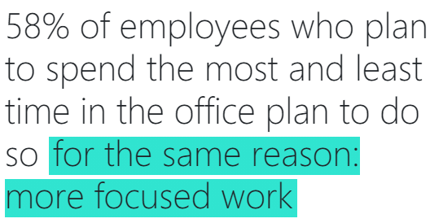

---
# https://github.com/chrisrhymes/bulma-clean-theme
#
layout: page
title: Goals and Non-Goals
subtitle: What we would love to see, and what not.
hero_image: img/blue.jpg
hero_darken: false
menubar: menu
---

## Goals

Please create a solution prototype that may help people build and maintain their personal "resilience", work&life balance and find new ways for satisfiying the sometimes contradictionary needs of people when it comes to the new "hybrid workplace".

## Non-Goals

Please do **NOT** create anything like to following (or at least - add some new, innovative twists):

- Another "Mindfullness" App
- Another "Mental Health" Q&A chatbot
