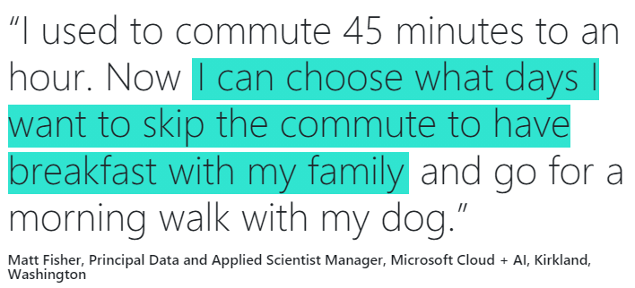

---
# Feel free to add content and custom Front Matter to this file.
# To modify the layout, see https://jekyllrb.com/docs/themes/#overriding-theme-defaults
layout: page
title: Challenge
subtitle: How to build personal resilience and "Own The Way You Work" (OTWYW) ?
hero_image: img/hero_image2.jpg
hero_darken: true
menubar: menu
---

## The Challenge

Tech & Data can do a lot to transform insurance, but can it also increase **Personal Resilience**?

We want to develop a solution to boost personal resilience and smooth the transition when we move to the hybrid working environment.

After the initial shock from the pandemic and subsequent lockdowns, it has become clear that home office can work well. Moving back to a hybrid working approach can mean more distractions, a stressful commute and less flexibility in general. How can we navigate this transition? How can we integrate some of the benefits we enjoyed when working from home? And if things get too much, where can we get support when needed, in particular, for our mental health?

We at Swiss Re believe that it's important to take the positive learnings from the past 18 months and create a work environment where people can come back feeling safe and can thrive, very much in the spirit of **Swiss Re's** "Own The Way You Work" (OTWYW)" approach.

**Help us develop solutions to support Personal Resilience and help our people to be their personal best in this crazy new normal.**

